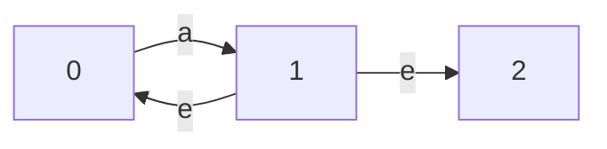
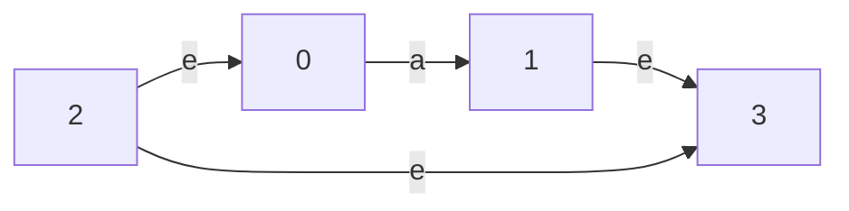
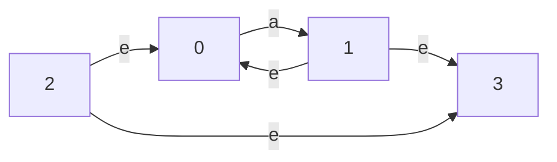
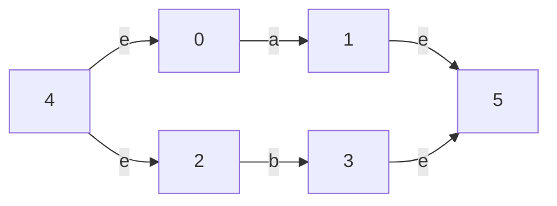
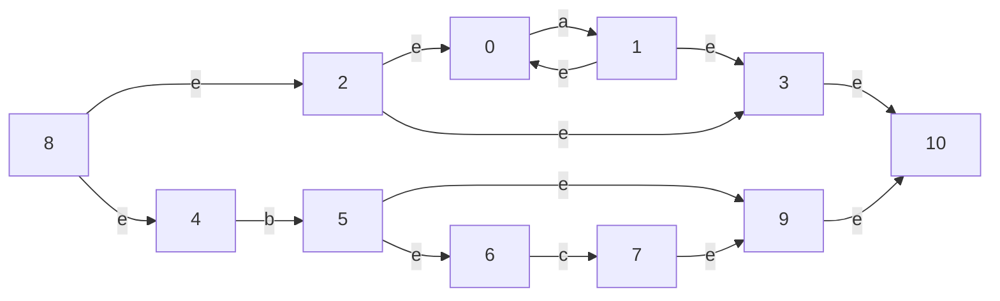
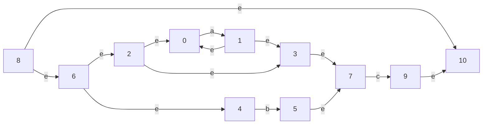

<!--

Copyright (c) 2023, 2024 Logan Ryan McLintock

Permission to use, copy, modify, and/or distribute this software for any
purpose with or without fee is hereby granted, provided that the above
copyright notice and this permission notice appear in all copies.

THE SOFTWARE IS PROVIDED "AS IS" AND THE AUTHOR DISCLAIMS ALL WARRANTIES
WITH REGARD TO THIS SOFTWARE INCLUDING ALL IMPLIED WARRANTIES OF
MERCHANTABILITY AND FITNESS. IN NO EVENT SHALL THE AUTHOR BE LIABLE FOR
ANY SPECIAL, DIRECT, INDIRECT, OR CONSEQUENTIAL DAMAGES OR ANY DAMAGES
WHATSOEVER RESULTING FROM LOSS OF USE, DATA OR PROFITS, WHETHER IN AN
ACTION OF CONTRACT, NEGLIGENCE OR OTHER TORTIOUS ACTION, ARISING OUT OF
OR IN CONNECTION WITH THE USE OR PERFORMANCE OF THIS SOFTWARE.

-->

spot monorepo
=============

Welcome to the _spot monorepo_ where multiple cross-platform applications share
code via _toucanlib_.

The applications are:
* [spot](#spot): The text editor,
* [m4](#m4): A POSIX compliant implementation of the m4 macro processor,
* [bc](#bc): A basic calculator, and
* [freq](#freq): Determines the character frequency in a file.

toucanlib has a monolithic interface to make usage easy, but multiple modules
to make maintenance easy. Currently, the modules include:
* gen: Generic functions,
* num: Number functions,
* buf: Various buffers,
* gb: Gap buffers,
* eval: Evaluate arithmetic expression,
* ht: Hash table,
* curses: Curses (terminal graphics), and
* fs: File system related functions.

Install
-------

This software is cross-platform and has been written in ANSI C with the minimum
use of non-standard libraries. To install, edit one of the scripts below
(depending upon your operating system) to set `install_dir`.
Then simply run:
```
$ make
$ PREFIX="$HOME" make install
$ make clean
```
or
```
> nmake /F nMakefile
> set PREFIX=%HOMEDRIVE%%HOMEPATH%&& nmake /F nMakefile install
> nmake /F nMakefile clean
```

Make sure `PREFIX/bin` is included in your `PATH`.


spot
====

spot is a cross-platform text editor that has been written in ANSI C with the
minimum use of non-standard libraries.

It uses double-buffering to display flicker-free graphics without using any
curses library.

Gap buffers are used to edit the text, which are very efficient for most
operations. A nice balance has been achieved between optimisation, features,
and code maintainability.

The region is the area between the cursor and the mark, with whichever appears
first included in the region and whichever appears last excluded from the
region. It is cleared by editing commands, and navigational commands are used
to change its coverage.

The status bar displays `!` if the last command failed, followed by `*` if the
buffer has been modified. The filename associated with the buffer is presented
next, followed by the current row and column number in brackets. The hex value
of the char under the cursor (which may be in the command line) is displayed.
Finally, the if the last command included a shell command which succeeded (the
process terminated normally), then the exit status is displayed.

The command line is at the bottom of the window and is used for _two-step_
commands that require user input. Most single-step commands work inside the
command line.

The keybindings are listed below. `^a` means pressing `Ctrl` plus `a`.
`^[` is the `Ctrl` key plus `[`, but is also generated by pressing the
`Esc` key. `LK` denotes the left key, and `RK` denotes the right key.

| Keys    | Command                                                   |
| :------ | :-------------------------------------------------------- |
| `^b`    | Left character                                            |
| `^f`    | Right character                                           |
| `^p`    | Up line                                                   |
| `^n`    | Down line                                                 |
| `^d`    | Delete character                                          |
| `^h`    | Backspace character                                       |
| `^a`    | Start of line                                             |
| `^e`    | End of line                                               |
| `^2`    | Set mark                                                  |
| `^g`    | Clear mark, or exit command line                          |
| `^l`    | Centre cursor on the screen and redraw graphics           |
| `^w`    | Cut region                                                |
| `^y`    | Paste                                                     |
| `^k`    | Cut to end of line                                        |
| `^t`    | Trim trailing white-space and remove non-printable chars  |
| `^s`    | Exact forward search (moves cursor to start of the match) |
| `^z`    | Regex forward search (moves cursor to after the match)    |
| `^r`    | Regex replace region *                                    |
| `^u`    | Go to line number                                         |
| `^q`    | Insert hex                                                |
| `^[ b`  | Left word                                                 |
| `^[ f`  | Right word                                                |
| `^[ l`  | Lowercase word                                            |
| `^[ u`  | Uppercase word                                            |
| `^[ k`  | Cut to start of line                                      |
| `^[ m`  | Match bracket `<>`, `[]`, `{}`, or `()`                   |
| `^[ n`  | Repeat last search                                        |
| `^[ w`  | Copy region                                               |
| `^[ !`  | Remove current gap buffer without saving ^                |
| `^[ =`  | Rename gap buffer                                         |
| `^[ $`  | Insert shell command from the command line                |
|``^[ ` ``| Insert shell command of logical line under the cursor +   |
| `^[ <`  | Start of gap buffer                                       |
| `^[ >`  | End of gap buffer                                         |
| `^x ^c` | Close editor without saving any buffers                   |
| `^x ^s` | Save the current buffer only                              |
| `^x ^f` | New gap buffer                                            |
| `^x i`  | Insert file                                               |
| `^x LK` | Move left one gap buffer                                  |
| `^x RK` | Move right one gap buffer                                 |


`+` The _logical_ line under the cursor is formed by joining neighbouring lines
that end in a backslash, to accommodate for long lines. These end-of-line
backslashes are removed from the logical line, as are `\n` characters.
`2>&1` is added to the end of the logical line, to capture `stderr` under most
situations. If some `stderr` text comes through uncaptured, then it can be
cleared by redrawing the screen (`^l`).

`*` Regex replace region syntax is `_find_replace` where the first character
(in this example, `_`) is the delimiter. The anchors, `^` and `$` are relative
to the region, not the buffer.

`^` Text editor will exit if it is the last gap buffer.


m4
==

This version of m4 is cross-platform (runs natively) and complies to
POSIX standard IEEE Std 1003.1-2017.

m4 is a general purpose macro processor. It performs text replacement, similar
to the C preprocessor, although it is not tied to any specific language. It
performs programmatic find-and-replace on text, but can also perform other
tasks, such as executing shell commands.

Usage
-----

```sh
m4 [-s] [-D macro_name[=macro_def]] ... [-U macro_name] ... file ...
```
Where:
* `-s` prints `#line` directive for the C preprocessor.
* `-D` defines the macro specified in the next argument, with optionally,
    the macro's definition given after a separating `=` character.
* `-U` undefines the macro name specified in the next argument.
* `file` is a list of regular files, with `-` denoting `stdin`. If no files
    are specified, then `stdin` is read by default.

How m4 works
------------

m4 has two classes of macros; built-in macros and user-defined macros.
Built-in macros are written in C and can only be added or modified by editing
the source code and recompiling. However you can undefine (remove) them and
you can make renamed copies of them that behave exactly the same.
If you undefine a built-in macro (and you don't have a renamed copy), then
you cannot get it back.

User-defined macros are written in the m4 language and are added using the
`define` macro.

m4 reads word-by-word from a centralised input buffer. If you are not in
a comment and quote mode is not activated, then each word is looked up in
a hash table to see if it is the name of a macro.
If it is then the macro is pushed onto the stack. If the macro takes
arguments, then these will be collected. When the macro is finished, for
user-defined macros, the arguments are substituted into the placeholders in
the macro definition and then the resultant text is pushed back into the
input. Built-in macros usually perform some other operation on the arguments,
and some of them also push the result back into the input.

Nested macro calls are handled by the macro call stack. While collecting the
arguments of one macro, another macro may be encountered.
m4 deals with macros immediately.
It will add the new macro to the stack and start collecting its arguments.
Only once processing of the inner macro is done, will execution return to the
outer macro. The inner macro may push its result back into the input which
will then be read and rechecked for macros, until eventually the text has been
fully expanded and ends up in the argument collection of the outer macro. This
gives m4 its powerful recursive nature, but also makes it confusing for
beginners.

m4 also has flexible output. At any given time the _output_ is either the
argument collection of a macro, or one of the eleven different diversions
(output buffers). Diversion -1 is discarded and is useful when defining a lot
of macros. Diversion 0 is regularly flushed to `stdout` and is the default.
Diversions 1 to 9 are temporary storage. Diversions 1 to 9 can be written to
file, which is very useful when writing dynamic code (this is an extension to
the POSIX standard). They can also be undiverted into each other and will all
be flushed to `stdout` if the program exits without error.

m4 uses quotes to suppress the expansion of macros by passing words directly
to the output. Quotes can be nested. When entering quote mode the left quote
is eaten, and when exiting quote mode the right quote is eaten, but quotes
in-between are retained. Due to the recursive nature of m4, text is often
evaluated multiple times, and each time the outer layer of quotes will be
striped.

m4 only checks for macros when reading from the _input_ in non-quote mode.
During argument collection, quote mode prevents commas from being interpreted
as argument separators (as do added parentheses). Once argument collection
is finished, quotes have no effect on the substitution of collected arguments
into their placeholders, this will occur irrespective of the depth of
quotation.


Example
-------

In the example below, the quotes are changed to `[` and `]`. Then a
new macro called `world` is created with a defining text of `cool`. `world` is
then shown to expand to `cool`, as expected.

```m4
changequote([, ])

define(world, cool)

world
cool
define(x, [[hello $1]])

dumpdef([x])
User-def: x: [hello $1]

x([world])
hello world
m4exit
```

It superficially looks like `x` is defined as `[[hello $1]]`, however, as
`[[hello $1]]` is read from the _input_, quote mode is entered and exited,
stripping off the outer layer of quotes. As shown by `dumpdef`, `x` is actually
defined with a single layer of quotes, `[hello $1]`.

`x` is called with what appears like an argument of `[world]`. However, as
`[world]` is read from the input, quote mode is entered and exited, stripping
off the quotes, resulting in a gathered argument of `world` (which was not
looked up in the hash table due to the quote mode).

The argument, `world` is substituted into the placeholder `$1`, interestingly,
unaffected by the quotes in the _definition_! The result, `[hello world]`,
(which cannot be viewed directly) is pushed back into the input. When this
is re-read, quote mode is entered and exited again, stripping off the quotes
and preventing `world` from being expanded, leaving the output as simply
`hello world`.

Quoting the input to `x` and the output from `x` gave no opportunity for
`world` to expand to `cool`.

I strongly recommend learning m4. For a small investment in learning it
provides a powerful tool that is free from a lot of the limitations imposed
by many programming languages.

Built-in macros
---------------

I will now introduce the built-in macros. All built-in macros that *require*
arguments exhibit pass-through, whereby the macro name is simply printed to
the output when it is called without arguments.

```m4
changequote[(left_quote, right_quote)]
```
Sets the left and right quote strings. Please note that they should be
different, non-empty strings that should only contain graph, non-comma,
non-parentheses characters, in order to function in a nice way with the
m4 design.
It is normally a good idea to pick strings that are not a commonly
used in any downstream programming language, such as `<[` and `]>`.
When called without arguments, the default quotes of backtick and apostrophe
are restored.

```m4
changecom[(left_comment[, right_comment])]
```
`changecom` changes the default left and right comment strings from `#` and the
newline to the ones specified. If called with only one argument, then the right
comment string defaults to the newline. When called without any arguments, then
comments are disabled. Text inside comments, and the comments themselves, are
passed though to the output. No interpretation is performed on text within
comments, besides checking for the right comment string to know when to exit
the comment.

```m4
define(macro_name, macro_def)
```
`define` creates a new user-defined macro (if it does not already exist), or
*updates* the current history of an existing macro, retaining any prior history
that may exist (but not-preserving the current history).

If the current history is a built-in macro, then it will still be updated, but
the ability to bring back the built-in nature will be lost (unless you have
another copy).

You can make a renamed copy of a built-in macro, which then acts exactly the
same as an orginal built-in macro. To do this you need to used `defn`,
for example:

```m4
define(x, defn(`m4exit'))

dumpdef(`x')
Built-in: x[(exit_value)]

x
```

This also works with `pushdef`.

Please note that quotes are usually wanted when replacing a macro, as otherwise
the macro will expand during argument collection, prior to the `define` macro
being executed.

Macro names must start with an alpha character or underscore followed
by none or more alpha, digit or underscore characters.

The macro definition is the text that the macro will expand into.
It can take argument placeholders, `$0` to `$9`. `$0` is the macro name.
`$1` to `$9` are the arguments collected when the macro is called.
A macro can take any number of arguments, but only the first 9 can be
referenced individually. $# expands to the number of collected arguments,
and $* to a comma-separated list of all collected arguments, and $@ to
individually quotes, comma-separated list of all collected arguments.

```m4
pushdef(macro_name, macro_def)
```
`pushdef` acts like `define`, except that if the macro already exists, then
the new definition will be stacked onto the history stack for that macro.
The current history will be preserved, and will become the macro definition
immediately below the new definition in the history stack.

`pushdef` can be used to make a renamed copy of a built-in macro by using
`defn` (this also works with user-defined macros).

```m4
pushdef(x, defn(`divnum'))

x
0
m4exit
```

```m4
defn(macro_name)
```
`defn` is often used to make a renamed copy of a macro.
For user-defined macros it pushes the quoted definition into the input.
For built-in macros, it passes back the C function pointer (its *definition*)
to the parent macro, but only when it aligns to the second argument
of `define` or `pushdef` (or renamed copies of these).

```m4
divert[(div_num)]
```
`divert` changes the active diversion. m4 commences in diversion 0,
which is regularly flushed to `stdout`. Diversion -1 is discarded,
and is often used when defining multiple macros, as the remaining newline
characters are typically not wanted in the output.

```m4
divnum
```
`divnum` pushes the active diversion number into the input.

```m4
dnl
```
`dnl` deletes up to (and including) the next newline character. Often used
for single-line *comments* that you do not want to see in the output, or for
removing the newline character after a macro definition.

```m4
dumpdef[(macro_name[, ... ])]
```
`dumpdef` prints the definition of the macros specified as arguments
(which should be quoted) to `stderr`. Useful as a help command, as it gives
the usage syntax for built-in macros. It lists all macros when called without
arguments, which is very useful when debugging.

```m4
errexit
```
This is an extension to the POSIX standard. It causes m4 to exit upon the first
user-related error.

```m4
errok
```
This is an extension to the POSIX standard. It causes m4 to continue execution
even when user-related errors occur. This is the default mode, and the expected
behaviour under the POSIX standard.

```m4
warnerr
```
This is an extension to the POSIX standard. `warnerr` treats warnings
as errors, which will then be affected by `errexit` and `errok`.

```m4
warnok
```
This is an extension to the POSIX standard. `warnok` makes warnings not to be
teated as errors. This is the default mode, and the expected behaviour under
the POSIX standard.

```m4
traceon[(macro_name[, ... ])]
```
Prints to `stderr` the location in the input file, the name of macro, and the
macro stack depth after they are invoked. This is at the beginning of argument
collection, not at the end when the macro is executed. The benefit in tracing
the macros this way, is that they appear in the same order as they do in the
source code, making debugging easier.

When called without arguments, then all of the existing macros are added to
the trace list (which is implemented as a separate hash table). When called
with arguments, then those specified macro names are added to the trace
list. Please note that to add a name to the trace list, the name must
be a valid macro name, but the macro need not exist. The list operates purely
on the text of the macro name, and hence, renaming macros does not inherit
the tracing status.

New macro names created after `traceon` called without arguments are not
automatically added, but `traceon` can be called again to add them.

```m4
traceoff[(macro_name[, ... ])]
```
When called without arguments, `traceoff`, clears the trace list and turns off
the tracing mechanism. When called with arguments, if tracing is on, then the
specified names are removed from the trace list (if tracing is off, then there
is no need to remove them as the list is cleared anyway).

```m4
errprint(error_message)
```
`errprint` prints a message to `stderr`.

```m4
syscmd(shell_command)
```
`syscmd` runs an operating system specific shell command. Nothing is returned
(pushed back into the input). No redirection of standard streams is performed.

```m4
esyscmd(shell_command)
```
`esyscmd` runs an operating system specific shell command and reads the
`stdout` of that command into the input.

```m4
eval(arithmetic_expression[, base, pad, verbose])
```
`eval` evaluates an arithmetic expression.
Works with signed _long_ integers. The default base is 10, but the `base` used
to display the result can be specified.
`pad` adds leading zeros to display the result with a minimum width.
If verbose is 1, then the postfix form of the expression is
printed to `stderr`.

`eval` interprets numbers starting with `0x` as hexadecimal and numbers
commencing with `0` as octal. For example:

```m4
eval(0xF - 010)
7
eval(0xBEEF + 0xCAFE)
100845
m4exit
```

The table below lists the operators (and parentheses) that are understood
by `eval`, along with their properties.

| Operator | Description | Precedence | Number of operands | Associativity |
| :------- | :---------- | ---------: | -----------------: | :-----------: |
| `(`      | Left parenthesis    | 12 |                  0 |     N/A       |
| `)`      | Right parenthesis   | 12 |                  0 |     N/A       |
| `+ve`    | Positive            | 11 |                  1 |     Right     |
| `-ve`    | Negative            | 11 |                  1 |     Right     |
| `~`      | Bitwise complement  | 11 |                  1 |     Right     |
| `!`      | Logical negation    | 11 |                  1 |     Right     |
| `**`     | Exponentiation      | 10 |                  2 |     Right     |
| `*`      | Multiplication      |  9 |                  2 |     Left      |
| `/`      | Division            |  9 |                  2 |     Left      |
| `%`      | Modulo              |  9 |                  2 |     Left      |
| `+`      | Addition            |  8 |                  2 |     Left      |
| `-`      | Subtraction         |  8 |                  2 |     Left      |
| `<<`     | Bitwise left shift  |  7 |                  2 |     Left      |
| `>>`     | Bitwise right shift |  7 |                  2 |     Left      |
| `<`      | Less than           |  6 |                  2 |     Left      |
| `<=`     | Less than or equal  |  6 |                  2 |     Left      |
| `>`      | Greater than        |  6 |                  2 |     Left      |
| `>=`     | Greater than or equ |  6 |                  2 |     Left      |
| `==`     | Equal               |  5 |                  2 |     Left      |
| `!=`     | Not equal           |  5 |                  2 |     Left      |
| `&`      | Bitwise AND         |  4 |                  2 |     Left      |
| `^`      | Bitwise XOR         |  3 |                  2 |     Left      |
| `\|`     | Bitwise OR          |  2 |                  2 |     Left      |
| `&&`     | Logical AND         |  1 |                  2 |     Left      |
| `\|\|`   | Logical OR          |  0 |                  2 |     Left      |


```m4
ifdef(macro_name, when_defined[, when_undefined])
```
`ifdef` checks to see if the first argument is a macro, and if so, pushes the
second argument back into the input. Otherwise, the third argument (if present)
is pushed back into the input. The macro name should be quoted to prevent it
from expanding during argument collection. Also, importantly, macros will be
expanded and processed immediately during argument collection, _before_ the
branch in logic. So, the second and third arguments should also be quoted.

For example, in the code below, `x` is defined, so we are expecting the result
of `great`. However, surprisingly, `y` is defined as `10` during argument
collection (as quotes were not used), even through this was not the logical
branch taken at the final execution of the macro.

```m4
define(x, cool)

ifdef(`x', great, define(y, 10))
great
y
10
m4exit
```

```m4
ifelse(switch, case_a, when_a[, case_b, when_b, ... ][, default])
```
`ifelse` is like a switch statement in C. The first argument is the str
that is compared against the 2, 4, 6, ... arguments, and upon the first match
the next argument is pushed back into the input. Finally, if there is no
match, then the default argument (the last argument, if present) is pushed back
into the input.

Remember that arguments will be expanded and processed during argument
collection, which occurs _before_ the branch in logic. So, it is a good idea
to quote arguments; 3, 5, 7, ... and the last argument.

```m4
shift(arg1[, ... ])
```
`shift` returns (pushes into the input) a comma-separated list of individually
quoted arguments, excluding the first argument.

```m4
include(filename)
```
`include` pushes the contents of a file into the input. Macros will be
processed.

```m4
sinclude(filename)
```
`sinclude` is a *silent* version of `include`, that does not generate an error
or warning if the file cannot be opened.

```m4
incr(number)
```
`incr` increments a number. The result is pushed into the input.

```m4
decr(number)
```
`decr` decrements a number. The result is pushed into the input.

```m4
len(str)
```
`len` pushes the string length of its first argument into the input.

```m4
index(big_str, small_str)
```
`index` returns the starting offset of where `small_str` is found inside
`big_str`. Offsets commence from zero. If there is no match, then -1
is returned (pushed into the input).

```m4
substr(str, start_index[, size])
```
`substr` returns (pushes to the input) a portion of `str` commencing from
`start_index` and continuing for `size` characters, or until the end of `str`,
if `size` is not specified. Indices commence from zero.

```m4
translit(str, from_chars, to_chars)
```
`translit` performs character-wise replace on `str` and pushes the result into
the input. A mapping of `from_chars` to `to_chars` is internally created in
order to perform the replacement. Each specified character in `from_chars`
is swapped to the corresponding character in `to_chars`. If `from_chars`
is longer than `to_chars`, then the characters without partners will be
deleted.

If the same character appears multiple times in the `from_chars`, then the
first appearance takes precedence (permitted, but unspecified by the POSIX
standard).

Ranges can be specified in the `from_chars` and the `to_chars` by
using a `-` between two characters. These ranges are logically expanded before
the mapping alignment is performed, meaning that the ranges do not need to be
of the same size. Ranges can also be descending, that is the starting
character can have a higher ASCII value than the ending character.
The start and end characters are included in the range.
Ranges are permitted, but unspecified by the POSIX standard.

```m4
m4wrap(code_to_include_at_end)
```
`m4wrap` stores code to be pushed into the input when `EOF` is reached
(before the diversions are automatically undiverted).
This code will then be evaluated as normal. Code will be evaluated in
chronological order if `m4wrap` was called multiple times. This is
useful for performing clean up.

```m4
lsdir[(dir_name)]
```
This is an extension to the POSIX standard. `lsdir` inserts a directory
listing, with a line of hyphens separating the directories (shown first)
from the files (shown second). If no argument is supplied, then the
current working directory is used.

```m4
m4exit[(exit_value)]
```
`m4exit` allows the user to request early termination of m4, specifying the
_desired_ exit value in the first argument. The requested value must be between
zero and `UCHAR_MAX`, inclusive. If called without arguments, then zero is the
default value. Please note that a requested return value of zero will be
overwritten if any errors occurred at any time during the operation of m4.
However, if the macro is called successfully, then a non-zero requested return
value will be used as the final return value of m4, regardless of other errors.

`m4exit` causes immediate termination, `m4wrap` is not performed and the
diversions are not undiverted.

```m4
recrm(file_path)
```
This is an extension to the POSIX standard. `recrm` recursively removes a path
if it exists. Any sub-file or sub-directories will be deleted along with the
specified path itself.

```m4
regexrep(text, regex_find, replace[, newline_insensitive, verbose])
```
This is an extension to the POSIX standard. `regexrep` searches text for
a regex pattern and replaces the matches. If the fourth argument is 1,
then newline insensitive matching occurs.
If verbose is 1, then the posfix form of the expression and the
nondeterministic finite automaton (NFA) structure are printed to `stderr`.

```m4
sysval
```
`sysval` pushes the return value of the last shell command run via `syscmd`
or `esyscmd` into the input.

```m4
tnl(str)
```
This is an extension to the POSIX standard. `tnl` trims trailing newline
characters from the end of the first argument.
This is useful in conjunction with `esyscmd` as trailing newline characters
are not stripped, as users are normally accustomed to with POSIX sh command
substitution.

For example, in the code below, `tnl` eats the trailing newline from the shell
command, preventing the sentence from being broken.

```m4
My name is esyscmd(whoami), hello!
My name is logan
, hello!
My name is tnl(esyscmd(whoami)), hello!
My name is logan, hello!
m4exit
```

```m4
undefine(macro_name)
```
`undefine` removes a macro and all of it history stack. Normally you should
quote the macro name to prevent it from expanding into its definition during
argument collection. Built-in macros cannot be retrieved once undefined,
unless you have previously made a renamed copy of them.

In the example below, `define` and `x` (via its inheritance) do not need to
be quoted when "called" without arguments, as they exhibit pass-through
behaviour (only certain built-in macro do this). The example clones
`define` to `x`, deletes `define`, then restores it from `x`.

```m4
define(x, defn(define))

undefine(define)

dumpdef(define)
Undefined: define

x(define, defn(x))

dumpdef(define)
Built-in: define(macro_name, macro_def)

m4exit
```

```m4
popdef(macro_name)
```
`popdef` removes the current history from the history stack, making the new
macro what the prior history was. If there was no prior history, then `popdef`
has the same effect as `undefine`. You will normally want to quote the macro
name.

```m4
undivert[(div_num_or_filename)]
```
`undivert` appends the contents of a diversion or file onto the current active
diversion. Undiverted diversions are emptied. A diversion cannot be undiverted
into itself, and diversion -1 cannot be undiverted (as it is discarded).
It is important to note that no processing occurs during this, macros are not
expanded. If an argument contains any non-digit characters, then it will be
treated as a filename (this is allowed, but unspecified by the POSIX standard).

```m4
writediv(div_num, filename[, append])
```
This is an extension to the POSIX standard. `writediv` empties the specified
diversion to file. It creates missing directories in the file path.
If append is 1, then it will append to the end of the file, otherwise the file
will be overwritten.

This macro is very useful for writing dynamic code. The code can be crafted
into a diversion, then that diversion can be written to file using `writediv`,
and then the file can be executed using `esyscmd`.

```m4
maketemp(templateXXXXXX)
```
`maketemp` replaces the trailing X's in `templateXXXXXX` with the pid
of the current process, and pushes the result back into the input.
It does not check if a file with that name already exists, and it
does not create a file. It is depreciated and should not be used.

```m4
mkstemp(templateXXXXXX)
```
`mkstemp` replaces the trailing X's in `templateXXXXXX` with random
characters and creates and closes a file by that name, pushing the
resultant filename into the input. Where available, this is done by
calling the C function `mkstemp` from `<stdlib.h>`.


bc
==

bc is a cross-platform basic calculator. It reads from `stdin` and works with
signed _long_ integers. See the m4 built-in macro `eval` above for more
details.


freq
====

`freq` determines the character frequency in a file. Non-graph characters are
displayed using their hex value. A character and its count are separated by
a space, and only characters present in the file are reported.

Usage:
```
freq file
```

toco_regex
==========

toco_regex is the built-in regular expression engine.

Preprocessed escape sequences
-----------------------------

Preprocessed escape sequences are converted before any regular expression
processing commences. This occurs on both the find and replace components.
As this is a preprocessing step, the results can become any part of the
regex. For example, `\x5B\x41\x2D\x5A\x5D\x2B` will become `[A-Z]+`.

The syntax is a subset of the C escape sequences. Most notably
the octal escape sequences are omitted. The recognised escape sequences are:

* `\0`
* `\a`
* `\b`
* `\t`
* `\n`
* `\v`
* `\f`
* `\r`
* `\xBE`

Where `BE` can be any two hexadecimal digits. Other backslashes are passed
through to the output, unchanged.

Integer array
-------------

After preprocessing, the find component becomes an array of integers that
is `EOF` terminated. This is so that it can handle the special escape sequences
of `\0` or `\x00` above, and not become null-terminated early.

From here, the find integer array is converted into a *chain* (a linked list)
with each link being either a character set or an operator.

Character sets
--------------

A character set is a selection of bytes from the 256 different bytes.
Single characters are automatically converted to a character set
containing only that character.

A dot `.` denotes a character set containing every character except for `\n`
(unless it is in newline insensitive mode, in which case `\n` is included too).

Character sets can also be created using square brackets, with the following
syntax:

* `[` commences the character set.
* `]` concludes the character set (but not if it would result in an empty set).
* `^` in the first position negates the set (by itself, the set is still
    considered empty, as it is not considered a "character").
* `-` between two characters creates a range (the negation symbol cannot be
    used as the start of a range).
* Character sets cannot be empty.
* All other characters in the set are treated literally, including backslashes
    (the ones that still remain after preprocessing) and operators.

```
     End of character set
     |
     v
[^A-Z]
^^ ^
|| |
|| Range
|Negation
Start of character set
```

For example:

* `[]]` is the set of just `]`. The first `]` does not conclude the set because
    the set would be empty, and empty sets are not allowed.
* `[^]]` is the set of all characters except for `]`. The first `]` does not
    conclude the set because the set would be empty because the negation symbol
    is not considered a *character*.
* `[-A]` and `[A-]` are the sets containing only the two characters
    `-` and `A`. The hypen is not interpreted as a range if there is not
    a character on either side of it.
* `[^-Z]` and `[^Z-]` are the sets containing all of the characters except for
    `-` and `Z`.
* `[^][^-]` is the set containing all of the characters except for
    `]`, `[`, `^` and `-`.

Backslashes
-----------

Backslashes (that still remain after preprocessing) outside of a character set
cause the following character to be treated literally. For example, `\*` would
be interpreted as a character set containing only the character `*` and not the
zero-or-many operator. Likewise `\[` would be treated as a character set
containing just the character `[` and not the commencement of an explicit
character set.

Operators
---------

If not escaped by a backslash or present inside a character set, the
characters in the table below are interpreted as operators (or parentheses).

Please note that the concatenation operator is implied, and not explicitly
written in the original regular expression. This is analogous to how
the multiplication operator of often not written when doing algebra.
To visualise the concatenation operator, a dot `.` is used when *displaying*
internal information in verbose mode. It is not to be confused with the `.`
character set which can be a part of the orginal regular expression *input*.

| Operator | Description | Precedence | Number of operands | Associativity |
| :------- | :---------- | ---------: | -----------------: | :-----------: |
| `(`      | Left parenthesis     | 4 |                  0 |     N/A       |
| `)`      | Right parenthesis    | 4 |                  0 |     N/A       |
| `+`      | One or more          | 3 |                  1 |     Left      |
| `?`      | Zero or one          | 3 |                  1 |     Left      |
| `*`      | Zero or more         | 3 |                  1 |     Left      |
| `.`      | Concatenation        | 2 |                  2 |     Left      |
| `^`      | Start of line anchor | 1 |             0 or 1 |     Right     |
| `$`      | End of line anchor   | 1 |             0 or 1 |     Left      |
| `|`      | Or (alternation)     | 0 |                  2 |     Left      |


Shunting yard algorithm
-----------------------

The regex chain of character sets and operators (or parentheses) goes into
the shunting yard algorithm, which, rearranges the links in the chain, placing
the expression into postfix form. This removes the parentheses and creates an
order that can be processed sequentially.

The precedence and associativity in the table above is used in this process.

Running the engine with verbose mode on will display the posfix form
to `stderr`.

Thompson's construction
-----------------------

Next the nondeterministic finite automaton (NFA) is made using Thompson's
construction. The posfix expression is "evaluated". This is analogous to
an arithmetic expression, but instead of doing maths, the complete NFA is
constructed by joining together NFA *fragments*.

These NFA *fragments* are the operands (analogous to numbers in an arithmetic
expression). Please note that one of the very clever things about
Thompson's construction is that every NFA "fragment" is, itself,
a complete and valid NFA! This enables the regex operators to work on a
generic NFA fragment, regardless of its internal structure.

That brings us to another key point. Only the start and end node are required
to define a NFA (well actually, only the start node is needed as the end node
could be ascertained by traversing the NFA, but it is more convenient to retain
this information during construction).

NFAs can contain epsilon transitions, which are transitions that can occur
without reading a text character. Epsilon transitions make it easier to
construct the NFA in a generic fashion.

A node can only have two transitions out of it when they are both epsilon.
The end node must have no transitions coming out of it.

When run in verbose mode, the transitions for a mermaid graph are printed
to `stderr`. These are very useful for visualising your regex and help to
create an intuitive understanding of them. This is how the mermaid graphs
below were generated.

The following characters have special meaning when displayed in the NFA
verbose output:

 * `e` epsilon transition.
 * `^` start of line read status.
 * `$` end of line read status.
 * `-` range of characters in a character set.

Literal versions of these charactes are displayed using hex escape sequence
notation to avoid confusion.
Please note that the `[` and `]` around character sets are not displayed.

Character sets are converted into the following NFA fragments:


Where `a` is the character set consisting of only `a`, and `0` is the start
node and `1` is the end node.

As another example, the character set `[A-Za-z0-9]` would look like:


The NFA fragment is then push onto the operand stack.

When an operator is encountered, the operands (NFA fragments) are popped off
the stack. This will be one operand for unary operators, or two operands for
binary operators. The operator makes extensions to the operand, and joins
together multiple operands in some configuration. The result will be a new
NFA fragment, which is then pushed back into the stack.

Please note that the start of line and end of line anchors are unique, in that
they are unary operators by default, but if no operand is available in the
stack, they create a NFA fragment in a similar as a character set.

This process will continue, until the whole regex has be evaluated and a single
NFA remains in the stack.

The following graphs show the changes that are made by each of the operators.

One or more operator `+`:



A new end node is created, and is attached using an epsilon transition.
This is required so that the end node has no transitions coming out of it
(as each fragment must be a stand-alone valid NFA under this method).
The epsilon is used so that no new filters (criteria) are introduced
by adding this node.

A *loop-back* is made allowing `a` to be matched more than once. Note that to
get to the end, `a` must be traversed at least once, so zero length matches
will not occur with this NFA.

It does not matter the structure of the operand, the same cookie-cutter
changes will be made by this operator, as only the start and end node of
the operand NFA fragment play a role in the extension of it.


Zero or one operator `?`:



New start and end nodes are created and the operand is connected in using
epsilion transitions. Then a *bypass* epsilion transition is created from
the new start to the new end node. This enables zero-length matches.

A new start node is needed because (under this method) nodes can only have two
transitions coming out of them when they are both epsilon.

Zero or more operator `*`:



This operator adds both the *loop-back* and *bypass* components to the operand.

Concatenation (displayed as `.`):


Concatenation joins the two operands together in series.
The contents (which include the outbound transitions) of the start node
of operand `b` are copied to the end node of operand `a` (this is OK,
as end nodes always have no transitions coming out of them).
Then the start node of operand `b` is deleted.

Start of line anchor operator `^`:


When an operand is available, this operator adds a new start node, and links to
the operand using a *start of line read status* transition. This is similar to
an epsilon transition, it that it can occur without reading a character,
however, the read functionality is asked for the status.
"Are we are the start of the line?"
The transition can only be made if the read functionality validates the status.
Please note that the read status cannot be known inside the NFA, it is related
to the *read functionality* of the input text.

When no operand is available, the NFA fragment looks similar to
the NFA fragment made for a character set:


End of line anchor `$`:

When an operand is available, it adds a new end node and links it using an
*end of line read status* transition.


When no operand is available, the NFA fragment looks like this:


Or (alternation) operator `|`:



The *or* operator connects two operands in parallel. It creates new start and
end nodes and connects in the operands using epsilon transitions.

Now let's look at some more compicated regular expression, to see what the
NFAs will look like.

This is the NFA for the `a*|bc?` regular expression:



The precedence of the operators is reflected in the generated NFA.
From the operator table above, it is clear that `|` has the lowest
precedence, and so the parallel connection occurs last.
Likewise, `?` has higher precedence than the implicit concatenation
between `b` and `c`, and hence, the `?` operator only affects `c`
and not `b`.

Parentesis could be used to change this. For example, the NFA for
the `((a*|b)c)?` regular expression would be:



The `*` operator has the highest precendece and applies only to `a`.
The parenthesis cause the *or* operator to put `a*` and `b` in parallel.
Then the concatenation with `c` is applied. Finally, `?` is applied
to the whole NFA, creating a *bypass*. Notice how the structure differs
from the previous example.


Running the NFA
---------------

Each node in the NFA corresponds to a state. Two state tables are used to
run the NFA. One table contains the current list of active states and the
other table is used to store the next list of states as transitions occur.
After transitions, the two tables are swapped, so that the *next* table
becomes the *current*, and *current* becomes *next* (which get cleared before
being used again).

To commence, the start node of the NFA is set in the current state table.
Then, without reading a character, epsilon and *start of line read status*
and *end of line read status* transitions are made (if possible).
In this phase, transitions are accumulative, analogous to water flowing
(everywhere the water goes will be wet).
If an epsilon transition is followed from node 4 to node 5, then both
of these nodes will be marked as in-state. This process continues iteratively
until there are no new states being added, that is, the current and next
state tables have the same contents.

A check is then made for matches. If the end node of the NFA is in-state,
then a match has occurred. The pointer of the current read location in the text
is recorded, called the *last match*.
It is OK to overwrite this value, as the overall winning match is the longest
match possible from the fixed starting point (the start of the text).

The maximum match length (overall match winner), can only be determined when
all the states have been eliminated. At this point, the length is the
*last match* pointer minus the pointer to the start of the text.

Please note that the way the end node was reached is irrelevant, and only the
start of text pointer and last match pointer are need to obtain the location
and length of the match.

Next a character is read. The character is looked up in the character sets
of the relevant in-state transitions. If the character is in the set, then
the transition can be made, and the destination node is recorded in the next
table. This is an elimination step. All source nodes, if not also a destination
node, are eliminated. This is also not an iterative step. In a way, it is
analogous musical chairs, when the music stops, if you don't have a chair
(a destination node), you are out!

Then, once again, a check is made for a winner. If there is
no winner then the process repeats until all states are eliminated.

The power of using a NFA for regular expression matching, is that the
*journey* through the NFA does not matter. At any moment, all that matters
is the current nodes that are in-state, not how those states were ascertained.
This is why NFA regex engines are immune from pathological regular expressions
(regexes that run inefficiently using the backtracking method).


Regex search
------------

So far we have only discussed the NFA matching a text from the beginning of the
text. But, if there is no match at the beginning, then there must be a way to
advance the NFA.

This is what the search function does. It runs the NFA from the start of the
text. If there is a match, then it is returned. If not, then the NFA is run
again, but this time starting from a pointer of `text + 1`. The starting
pointer continues increment until a match is found, or the text is exhausted.

As it advances it is important that the read functionality keeps track of
the start of line status, as a given NFA run may be commencing mid-line.


Regex replace
-------------

Regex replace leverages off regex search. If the search finds a match, then
the text before the match is passed through to a buffer, and then the
replacement text is added to the buffer. This process repeats, commencing
the next search from the pointer of the match plus the match length.
When no match is found, the remaining text (if any) is added to the buffer.

This regex engine does not add the replacement text when there
is a zero length match *and* the match commences at the end of the previous
match.

There needs to be a way to advance when a zero-length match is
found. The simple thing to do is to jump one character and commence the
next search from there. However, it is important to note, that the jumped
character must be passed through to the output buffer.


Enjoy,
Logan =)_
